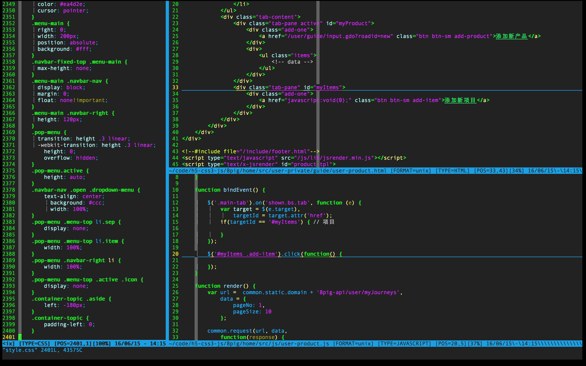

This is originally forked from https://github.com/ma6174/vim, and thank ma6174 for his great vim configuration which built the base code of this repository.

Learn more about me, please refer to http://jsongo.github.io.

### Screen shot:

### The way to install by hand, in linux for example：

Pull the code:

mkdir vim

git init 

git remote add origin https://github.com/jsongo/vim_jsongo.git

git pull origin jsongo

- Install vim `sudo apt-get install vim`
- Install ctags：`sudo apt-get install ctags`
- Other tools needed：`sudo apt-get install xclip vim-gnome astyle python-setuptools`
- python format tool：`sudo easy_install -ZU autopep8`
- `sudo ln -s /usr/bin/ctags /usr/local/bin/ctags`
- mv -f ~/.vim ~/.vim_old
- mv -f ~/.vimrc ~/.vimrc_old
- mv -f .vimrc ~/
- mkdir ~/.vim
- mv -f * ~/.vim
- clone bundle ：`git clone https://github.com/gmarik/vundle.git ~/.vim/bundle/vundle`
- Run `:BundleInstall` to build these plugins.
- restart the vim to see the surprize.
